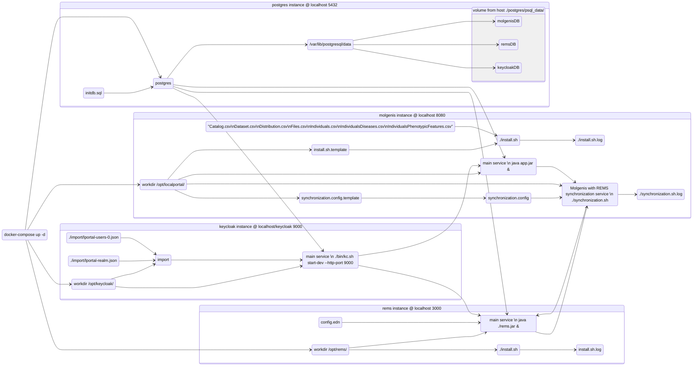

# Local portal: a proof of concept implementation

This is the `docker compose` environment that configures
 - [Molgenis](https://github.com/molgenis/molgenis-emx2) platform as a `Localportal` - a service to locally store and serve the GDI metadata, discoverable through various interfaces (FDP, Beacon, browsing, API calls ...)
 - `REMS` from scratch - providing the Data access requests, it is automatically synchronized from `Molgenis` > `Dataset` table
 - `Keycloak` - as a central AAI mockup service (holding the test realm and test users)
 - and a `Postgres` - holding three separate databases for the first three services

This few services should provide complete environment to showcase the Localportal usage.

System requirements depends on OS, but normaly docker host needs for compose at least
 - 2 core and 3 gb or free memory (on top of running OS) for build and spinup of instance
 - and approx. 2 GB of empty disk space for all the images with pre-populated data

Total image build time, spinup time, and the installation of services inside running instances is approx 5 minutes (depends on the system)

## Cloning repository and starting the services

Clone the repository and navigate to proof-of-concept branch

    $ git clone https://github.com/molgenis/gdi-localportal
    $ cd gdi-localportal

The `keycloak` hostname should point to the localhost `127.0.0.1` - by adding on the machine that is running docker compose in the `/etc/hosts` file

```
    127.0.0.1   localhost localhost.localdomain localhost4 localhost4.localdomain4 keycloak
```

After the docker service has been started, you can spin up the docker compose

    $ docker compose up -d

(the build time is approx. 4 min on slower hosts - after that the instances still need to configure the services, which takes additional 2 minutes or so)

Ports exposed on the host machine are
 - `3000` for rems
 - `5432` for postgres
 - `8080` for molgenis
 - `9000` for keycloak

## First use of the Localportal

First make sure that all of the services are running: use `docker-compose ps -a` and make sure all the instances are having status `healthy`.

### Example 1: Data manager adding/editing dataset

Showing how to add and change the Datasets into Molgenis, and how that gets updated on REMS.

Localportal

 - navigate to [Localportal](http://localhost:8080/)
 - use right to site `Sign In` > you will be redirected to [keycloak](http://keycloak:9000)
   - the use username is `lportaluser` and the password `lportalpass`
 - go to [gdiportal](http://localhost:8080/gdiportal/) - it is already pre-populated with example data 
   - check the table [Dataset](http://localhost:8080/gdiportal/tables/#/Dataset)
   - this table's content get replicated to REMS
     - the fields `id` and `title` are automatically synchronized with REMS
   - select one of the Dataset entry and delete it (for example "B1MG-RD-files-ped")
   - create a new entry (click plus sign at the top of the table left of the "id" field), you can fill the following data
     - id: "fastq_samplesX"
     - title: "Assembly of sample fastq file's from the dataset X"
     - tick the checkbox GDI
     - click "Save Ddataset"

Rems
 
 - navigate to [REMS catalogue](http://localhost:3000/catalogue)
 - click "Login" > your login will be automatically detected (since you just did it in the Localportal)
 - you should be able to see all the datasets except the "B1MG-RD-files-ped" that you deleted
 - the newly created "fastq_samplesX" is available, and it contains the link from REMS to the correct entry form at Localportal

### Example 2: user finding and requesting data access

Localportal - gportal

 - there is web interface available at the `Localportal` > [gportal](http://localhost:8080/gdiportal/gportal/#/)
   - [Find dataset](http://localhost:8080/gdiportal/gportal/#/datasets) shows all the datasets available and their description, it also provides data access request
   - [Search with Beacon](http://localhost:8080/gdiportal/gportal/#/beacon) shows the web front end of creating Beacon v2 queries on top of available datasets

## The files locations inside the instances

If you wish to check the additional logs inside the instances, you can use (example for Localportal)

    $ docker compose exec localportal /bin/bash

The instances have stored their installation files and the output of those installations inside
    /opt/[instance name]/

users per service

global shared environment

services are in /opt/{servicename} folders

# Instance notes
## Molgenis / Localportal

localhost:8080 > signin
    lportaluser
    lportalpass


Logs for localportal
    docker compose exec localportal /bin/bash
    root# cat /opt/localportal/install.sh.log

## REMS

Increase synchronization script verbosity:
    $ docker compose exec rems /bin/bash
    root# echo VERBOSE=2 >> /opt/rems/synchronization.config
    root# source /opt/rems/synchronization.sh


## Keycloak

Is avaialable on http://keycloak:9000 (or http://localhost:9000 )

You can modify the existing lportaluser or make a new one, by loging into Keycloak
 - go to Administration Console and use default keycloak admin username `admin` and password `admin`
 - switch realm from `master` to `lportal`
   - here you can modify lportalclient ( client > lportalclient )
   - or modify users ( Users > lportaluser   


## Postgres

Service is created from the latest available postgres docker container. The initial installation creates the databases with help of the script `initdb.sql`.

`postgres/psql_data` folder on the host machine is exposed as a `/var/lib/postgresql/data` volume inside the postgres instance.
This ensures that the database is safely stored across accidental instance reboots.

In case you wish to delete the postgress data and start with fresh instance, you can issue

```
    $ sudo rm -rf postgres/psql_data/ ; mkdir postgres/psql_data/
```
to delete the database folder and recrete an empty folder to store the future data.

# Cleanup
## Rebuild all the instances - complete w/ remove the database data

```
    $ docker compose down --rmi all -v                                  # shut down and remove all images and volumes
    $ sudo rm -rf postgres/psql_data/; mkdir postgres/psql_data/        # clean all the permanent postgres data
    $ docker compose up -d --force-recreate --build
```

## Shutting down and cleaning up

```
    $ docker compose down --rmi all -v                                  # shut down and remove all images and volumes
    $ sudo rm -rf postgres/psql_data/; mkdir postgres/psql_data/        # clean all the permanent postgres data
```

# Overview diagram

The service calls and scripts connected are shown here.


