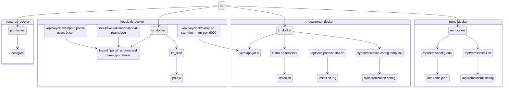

# Local portal: a Proof of Concept implementation

Repository is holding the `docker-compose` environment that configures from scratch the
 - `Localportal` (Molgenis) - to hold the GDI metadata, exposed via various interfaces: web page, FDP, Beacon
 - `REMS` from vanilla environment - for Data access requests, automatically from Localportal > Dataset
 - `Keycloak` - for a central AAI
 - and a `Postgres` instance holding all three databases

System requirements depends on OS, but usually docker host needs at least
 - 2 core and 3 gb or free memory (after OS) during build and spinup of instance
 - and approx. 2 GB of empty disk space for all the images with pre-populated data

Total image build time, spinup time, and the installation of services inside running instances is approx 5 minutes (depends on the system)

## Cloning repository and starting the services

Clone the repository and navigate to proof-of-concept branch

    $ git clone https://github.com/molgenis/gdi-localportal
    $ cd gdi-localportal

The `keycloak` hostname should point to the localhost `127.0.0.1` - by adding on the machine that is running docker-compose in the `/etc/hosts` file

```
    127.0.0.1   localhost localhost.localdomain localhost4 localhost4.localdomain4 keycloak
```

Start the docker compose

    $ docker-compose up -d

(the build time is approx. 4 min on slower hosts - after that the instances still need to configure the services, which takes additional 2 minutes or so)

Ports exposed on the host machine are
 - 3000 rems
 - 5432 postgres
 - 8080 localportal
 - 9000 keycloak

## First use of the Localportal

Localportal

 - navigate to [Localportal](http://localhost:8080/)
 - use right to site `Sign In` > you will be redirected to [keycloak](http://keycloak:9000)
   - the use username is `lportaluser` and the password `lportalpass`
 - go to [gdiportal](http://localhost:8080/gdiportal/) - it is already pre-populated with example data 
   - check the table [Dataset](http://localhost:8080/gdiportal/tables/#/Dataset)
   - this table's content get replicated to REMS
     - the fields `id` and `title` are automatically synchronized with REMS
   - select one of the Dataset entry and delete it (for example "B1MG-RD-files-ped")
   - create a new entry (click plus sign at the top of the table left of the "id" field), you can fill the following data
     - id: "fastq_samplesX"
     - title: "Assembly of sample fastq file's from the dataset X"
     - tick the checkbox GDI
     - click "Save Ddataset"

Rems 
 - navigate to [REMS catalogue](http://localhost:3000/catalogue)
 - click "Login" > your login will be automatically detected (since you just did it in the Localportal)
 - you should be able to see all the datasets except the "B1MG-RD-files-ped" that you deleted
 - the newly created "fastq_samplesX" is available, and it contains the link from REMS to the correct entry form at Localportal

Localportal - gportal
    - there is `gportal` web interface avaialable at the `Localportal` > [gportal](http://localhost:8080/gdiportal/gportal/#/)

## The files locations inside the instances

### Overview



If you wish to check the additional logs inside the instances, you can use (example for Localportal)

    $ docker-compose exec localportal /bin/bash

The instances have stored their installation files and the output of those installations inside
    /opt/[instance name]/

users per service

global shared environment

services are in /opt/{servicename} folders

# Local portal

localhost:8080 > signin
    lportaluser
    lportalpass


Logs for localportal
    docker-compose exec localportal /bin/bash
    root# cat /opt/localportal/install.sh.log

# REMS

Increase synchronization script verbosity:
    $ docker-compose exec rems /bin/bash
    root# echo VERBOSE=2 >> /opt/rems/synchronization.config
    root# source /opt/rems/synchronization.sh


# Keycloak

Is avaialable on http://keycloak:9000 (or http://localhost:9000 )

You can modify the existing lportaluser or make a new one, by loging into Keycloak
 - go to Administration Console and use default keycloak admin username `admin` and password `admin`
 - switch realm from `master` to `lportal`
   - here you can modify lportalclient ( client > lportalclient )
   - or modify users ( Users > lportaluser   


# Postgres

In case that the postgres instance would get accidentaly restarted or shut down, the database files are saved stored safely inside the host machine `postgres/psql_data`. This folder is exposed as a volume of the postgres instance.
In case you wish to delete the postgress data and start with fresh instance, you can issue

    $ sudo rm -rf postgres/psql_data/ ; mkdir postgres/psql_data/

this command will remove the existing data and recreate the `psql_data` folder.

# Shutting down and cleaning up

    $ docker compose down --rmi all -v                                  # shut down and remove all images and volumes
    $ sudo rm -rf postgres/psql_data/; mkdir postgres/psql_data/        # clean all the permanent postgres data
